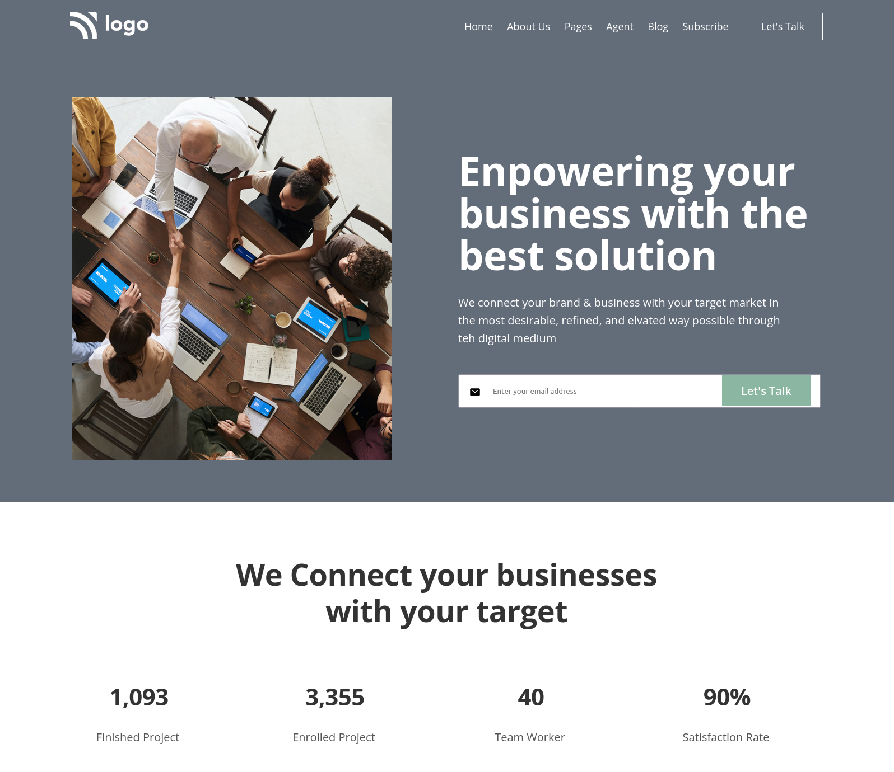
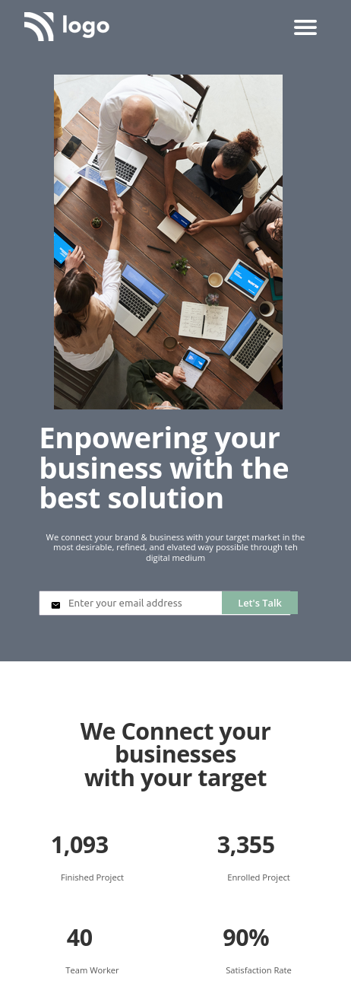

# PROJECT 12 - Business solution

This is the 12th responsive-challenge among the 15 Ineuron-projects.

## Table of contents

- [Overview](#overview)
  - [Screenshot](#screenshot)
  - [Links](#links)
- [My process](#my-process)
  - [Built with](#built-with)
  - [Time required](#time-required)
  - [What I learned](#continues-development)
  - [Useful resources](#useful-resources)
- [Author](#author)
- [Acknowledgments](#acknowledgments)

## Overview

### Screenshot





### Links

- Code File URL: [github.com](https://github.com/Jyotimoykathar/Project--12)
- Live Site URL: [netlify.app](https://project-12-business-solution.netlify.app/)

## My process

### Built with

- Semantic HTML5 markup
- CSS custom properties
- Flexbox Css
- Grid Css

### Time required

Nearly 5 day required to get the desired responsive and over all completion of the project.

### What I learned

This is the css design code snippet of the media queries for phones.
Through which I got little more understand of media queries and positions images.
Responsiveness of the page can be more smoth and animation need to be added.

```css
/* Below 544px(Phones) */
@media (max-width: 34em) {
  .grid--4-cols {
    grid-template-columns: repeat(2, 1fr);
  }
  .heading-secondary {
    font-size: 3.8rem;
    line-height: 1;
    margin-bottom: 4.6rem;
    padding: 0 2rem;
  }
  .description {
    font-size: 1.4rem;
    line-height: 1.2;
    margin-bottom: 4.6rem;
    text-align: center;
    /* padding-right: 4.3rem; */
    padding: 0 1rem;
  }
  .hero-img-box {
    width: 40rem;
    height: 55rem;
    margin-bottom: 2rem;
  }
  .hero-img {
    height: 100%;
    width: 94%;
  }
  .mail-input {
    padding: 0.8rem 4.6rem;
    padding-right: 11rem;
  }
  .mail-icon {
    font-size: 1.6rem;
    top: 1.6rem;
    left: 2rem;
  }
  .btn-mail {
    right: 2.4rem;
    top: 0.1rem;
    font-size: 1.6rem;
    padding: 0.8rem 2.6rem;
  }
  .carrier-image-box {
    width: 50rem;
    height: 52rem;
  }
  .footer-nav-icon {
    gap: 1rem;
  }
  .footer-social-icons {
    font-size: 1.2rem;
    padding: 1.4rem;
  }
}
```

### Continued development

I still have a lot to learn about flexbox and Grid. Animation and javaScript will be added soon to the webpage.

### Useful resources

- [MDN](https://developer.mozilla.org/en-US/) - This website helped me to any thing i had to look upon.
- [ION ICONS](https://ionic.io/ionicons) - This is an amazing site that provides open source icons that's very easy to implement to the page.

## Author

- Github page- [Jyotimoykathar](https://github.com/Jyotimoykathar/)

## Acknowledgments

Special Thanks to Ineuron team for the poject to improve my CSS flexbox and Grid skills with media queries.
